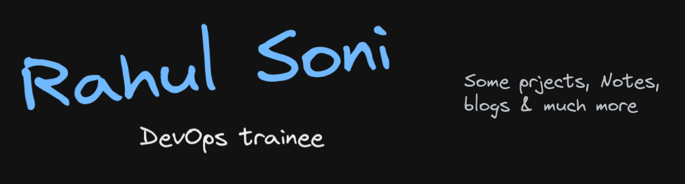

<h1 align='center'> Hi!, Devs :wave:</h1>

<!-- 
for images 
 
     
for anchor images 
  
--->
### About me
- 👀 I’m interested in Software development & automation practices with cloud
-  Curently working in [Knolduc Inc](https://www.knoldus.com/)
- 💻 I’m currently learning DevOps tools & CICD best practices.
-  How to reach me -> [mail me](mailto:rahul989741@gmail.com)
-  LinkedIn Profile [Rahul Soni ](https://www.linkedin.com/in/rahul-soni-6592811b2/)

### DevOps Tools

      

### Build Tools
   

     
---
## Stats

